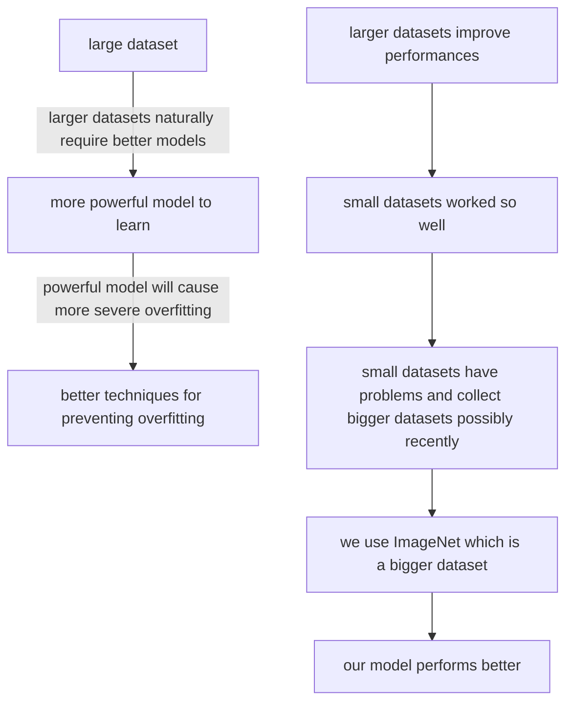
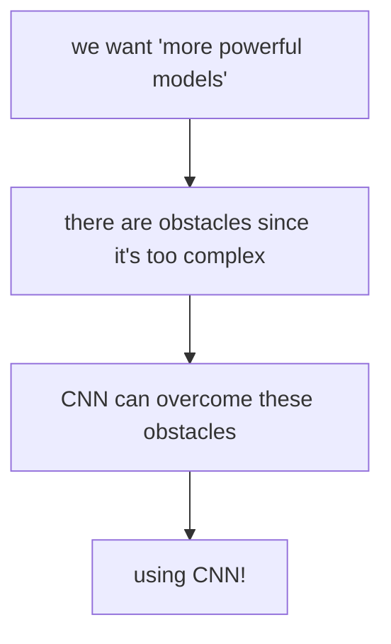
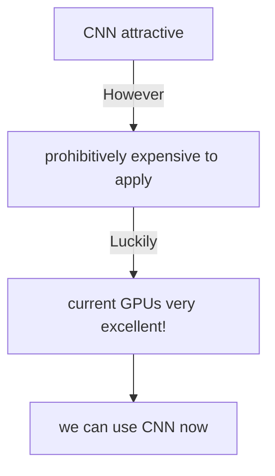
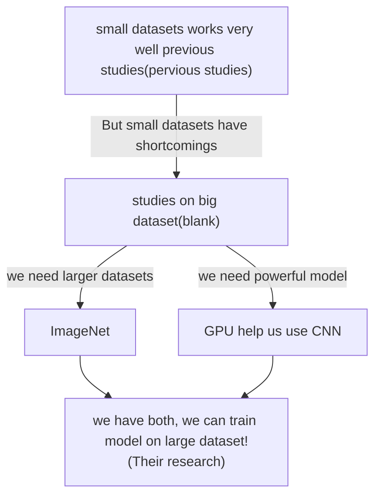
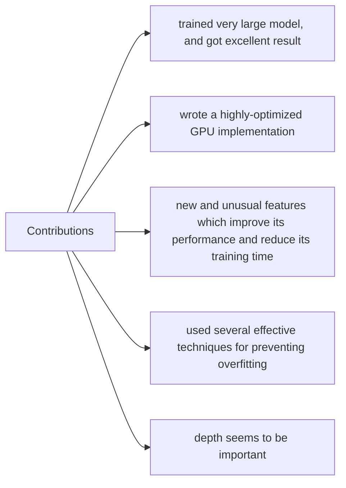

# Summary for “ImageNet Classification with Deep Convolutional Neural Networks”

[TOC]

This is a very old paper(2012), but it is very classical. Many people in the DL/ML area regard this paper as one of the fundamental papers in DL, a paper like this we should never miss.

Because the main writer of this paper is Alex Krizhevsky, we call this paper and the model introduced in this paper Alexnet. 

From the bigger picture, the structure of this paper is like AIBC, however, it do not have a conclusion but in the end is a disscussion. 

## Abstract

The abstract of this paper is very simple, it is mainly about they had trained a very large model, and this model worked extremely well. The first two sentences tell us the result, their big model works very well. Here, people will have some interest on their model, after all, the result is pretty good, so people will naturally want to see how they build their model. This leads to the third sentence, which tells us about the structure of this model, but in fact, what they want to emphasize is their model is unbelievably big because at that time training a such big model was impossible for two reasons, expensive and time-consuming. Besides, it is also very easy for deep models to be overfitting. Here, people will naturally want to know how they solve these problems. Logically, the fourth and fifth sentences talked about efficiency and reducing overfitting. In the end, as an additional part, they showed that their model worked also pretty well with other competition. To some extent, this shows their structure has some universal abilities.

## Introduction

The first paragraph is a very typical paragraph consisting of background and previous studies. The first two sentence is cutting point in my personal view.  It mainly conveys that nowadays it is very popular to use ML in object recognition, and there are some ways to improve performance. Then they introduced that it is already excellent in some small image datasets. However, there are shortcomings in small datasets and it is possible for bigger data only recently. We can see the rest part of the first paragraph echoes the "larger datasets" in the second sentence. It mainly wants us to know the ImageNet that they used to train their model is better because it is bigger, and bigger datasets mean better in most cases. 

The second paragraph mainly talked about "a model with a large learning capacity", which echoes the "more powerful models"  in the first paragraph. They present that we better use CNN to create this "more powerful model". In fact, it has some problem here, becaus e CNN is not popular at that time, and only mention CNN is a very narrow perspective, normally we will also introduce some other ways.

The third paragraph mainly talks about why now we can use CNN, but before we can't.

From the previous three paragraphs, we can see the logical link between the blank and their work is very clear. 

The fourth paragraph mainly talks about the contributions, and also, it shows the whole structure of this passage, which I think is a very clear and clever way to present the structure of this paper. It combines the contribution and introduction of the structure of the rest of this paper naturally, and smoothly.

The third contribution is very important because it proposes a new thing, that can give us some new inspiration, which is very useful in research. Contrarily, the second contribution is not that important because it is mainly about engineering implications. This may need lots of time, and it may be really excellent, but researchers will prefer papers that can give them ideas, and then they can follow up.

The fifth paragraph also writes about some technical implications, which may be very subtle, but for a long time, it is useless.

It was common sense at that time that we use regulation to prevent overfitting, but in today's view, it seems that the regulation is not that essential.

## Dataset

In the introduction, we can some signs of dataset-model-overfitting, but it is more clear in 2, 3, and 4 parts, since it is literally followed this order. 

The first two paragraphs just introduce the InageNet, since the larger dataset is one essential point in this paper. 

The third paragraph is more important since in this paragraph they write how they pre-process the image. The most important point here is they only cut the picture then they do nothing more. It is quite different from the popular methods at that time, because people will first extract some features from the raw materials and then use these features to train. However, they trained their network on the (centered) **raw** RGB values of the pixels. In this paper, the writer didn't emphasize this, but later people noticed the significance of this way. So, now in CV area, most researchers will use end-to-end methods, which are raw materials in and the neural network can do a good job.

## The Architecture

This is actually the "more powerful model" part, and it is very long.

### ReLU Nonlinearity

They use new nonlinearity, which they showed that it is very fast. If they didn't use it, they may not be able to do their experiment.

However, they do not talk about why it is fast, instead, they give other papers to prove this result, which means if we want to know why it is fast we need to read other papers. Writing in this way will cause many obstacles to readers, and destroy the consistency of the passage. In fact, we better make some brief explanation which will absolutely be better.

From today's view, we know that the model trained faster in fact have no significant relation between these nonlinearities, and reasons explaining why RelUs are faster in fact are wrong to some extent. Nevertheless, people still use ReLUs just because it is simple. Simpler will last longer.

### Training on Multiple GPUs

they think the second reason why their model trained faster is they use multiple GPUs.

In this part, they just talk about why they use multiple GPUs, how they use multiple GPUs, and the benefits they get from this way.

### Local Response Normalization

This part shows that even though ReLU do not need normalization, if you do some normalization, the result will be better. 

However, they still only introduced how they do, what method they use, they do not show why they use this method.

### Overlapping Pooling

In this part, the writer shows that they do some change on the traditional pooling layers, and the result is better.

### Overall Architecture

This part basically introduced their network architecture, how many layers, types of the layers, the settings of the kernels, and so on. The biggest difference here is they cut the network into two parts horizontally since they have two GPUs. Each part do their own thing separately and only communicates in specific layers. 

After all these process, we got a vector of the length of 4096. This vector in factor is a very good feature which we have talked above. So, the whole process is like transfer data from a way humans can understand(original picture) to a way machine can understand(the 4096 vector). Then we use a very simple softmax to classify, and we can get a very good result.

The writers think their method(**model parallel**) is a big contribution but in fact, nobody followed their methods until LLM came out.

## Reducing Overfitting

This part is actually about "prevent overfitting".

### Data Augmentation

From my personal view, I think data augmentation mainly is about using some tricks to make the training set bigger, and they give two ways to do it. the first one is doing it on space, the second one is doing it on RGB channel.

### Dropout

This part is kind of interesting.

First, he introduces a common method to reduce test errors which is model ensembles, however, he said it is no suitable for DL. Then he gives their own solution: dropout layer. The following part is the introduction of dropout. When you read, you may get confused about why they talked bout model ensemble at first, since it seems that dropout has nothing to do with model ensemble. Nevertheless, when you think a little bit thoroughly, you'll find that dropouts create many different models and in the end, we combine the results of these different models which is exactly how model ensembles work! 

This is what they think, however, from today's view, we will not take dropout as a way to do model ensembles but as a regularization.

## Details of learning

In this part they introduced that they used stochastic gradient descent(SGD). This part is very mathematical and fillfulled with lots of parameters.

## Results

Results are mainly about the error rates, the accuracy, and other things their models achieve, they try many different structures of their model. Anyway this part shows their model is very good.

### Qualitative Evaluations

Since they cut the kernels into two parts, they find that kernels in GPU 1 are largely color-agnostic and kernels in  GPU 2 are largely color-specific, they don't know why, they just find this phenomenon. 

They also find that pictures have the similar final 4096 vector are actually similar, this is a very significant finding as we mentioned above. It gives other researchers good inspiration, and after this paper, many researchers research on what each layer do even what each neural do. Now, even we don't know what each neural actually do, but at least we know some neural have specific function.

## Discussion

Showing that depth is very important, this is indeed true, but the way they concluded is wrong. Taking away a layer and the accuracy decreased can not say that depth is necessary, because it may only show that your parameters are not good.

No unsupervised pre-train, it leads to a new trend that the DL area shifts their attention to supervised data, since before they were more focused on unsupervised data. Now we think it take it as normal, but just 10-15 years ago, the whole DL area aimed to let machines learn things from no labeled data, just like human, since sometimes people learn things that do not needs "label" or things like that. Recently, NLP again shifted the attention to the unsupervised data.

# In the end

图片，深度学习训练出来的向量特别好，可以吧相似的图片提取出来放到一起，那么这个向量其实就是一个特别好的feature，最后我们就可以用一个很简单的softmax去分类。In this paper， the writer shows the result, however, they didn't realize the significance of this result, so they do not show how important it is. They literally only show it out

However, even though it is a very insightful, inspiring paper, from the perspective of "writing", it is not very good. The biggest problem is the writers do not mention why this model is good for head-to-toe. They basically only show the structure of their model, and the results are extremely good, and that's it. It is more like a technique report but not a paper. There are many significant points in this point but the writer didn't realize them at all. They did not highlight the most important work or they highlighted wrongly.

From the perspective of now, many things in this are actually wrong, and many details are unnecessary.

