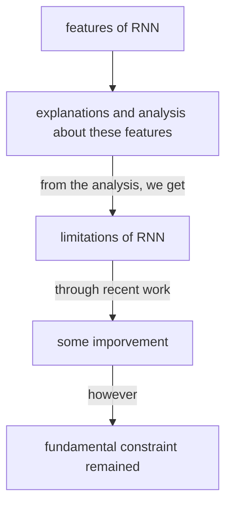
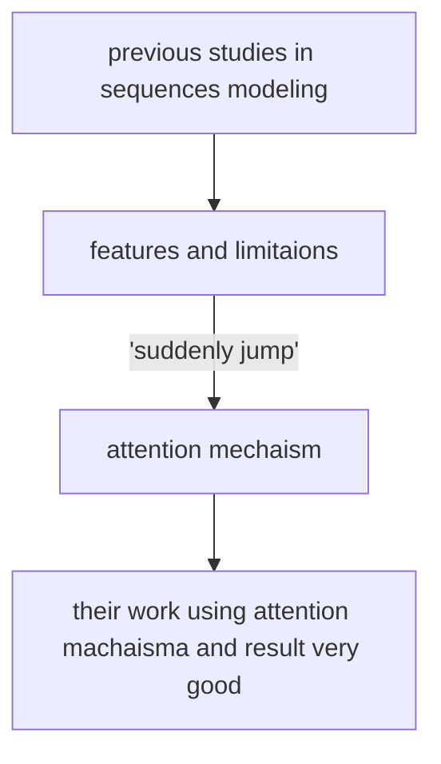

# Attention Is All You Need

[TOC]

There is a very interesting point in this passage that there are eight authors and each author has an equal contribution. This is very rare. This paper also detailed lists the contribution of each author separately which I think is a good style.

## Abstract

The first sentence mainly talks about the structures of current models.

Now we have some basic information about these current models, but if we have to make some improvements or achievements, we must focus on the best. So, the second sentence talked about a mechanism that currently best models used, which is the attention mechanism.

The third sentence talked about their contributions. They propose a simple and different model.

The fourth sentence mainly talks about the results of some experiments, which is very good. 

In the rest part of the abstract they also showed many excellent results their models achieved in some competitions.

This paper mainly focuses on the machine translation area, in fact, it is a small area that is not enough to support the outstanding success of this paper. The main reason for this paper being success is that later people noticed that this mechanism can be applied almost everywhere. To video, to picture.

## Introduction

The introduction is short in this passage, we can almost regard it as an extension of the abstract.

The first paragraph still talks about background and previous studies. The first sentence introduces the three popular models in sequence modeling. The second sentence, in addition, points out that these three models are not being "firmly established as state of the art approaches" for reasons. There are numerous efforts put into them.

The second paragraph mainly talks about RNN's features and consequent shortcomings. We can still mainly include it into the background, since the previous studies are a tiny part here. 

We can see the logical relation between sentences: the first sentence says the feature of RNN generally, and then the second sentence explains this feature in mathematical form. 
$$
h_t = f(h_{t-1},t) \notag
$$
The third sentence then analyzes this feature and points out the limitation. The fourth sentence is kind of like a turning point, showing that these limitations have been improved by some previous studies. However, the second turning follows with the fourth sentence, presenting that the fundamental constraint remains.

The third paragraph seems to suddenly jump to the attention mechanism, however, this mechanism leads to their work, which is talked about in the fourth paragraph. In the third paragraph, they introduce the attention mechanism and its merits. In the end, they point out that even though this mechanism is excellent, most researchers only take it as conjunctions.

The fourth paragraph finally talked about their work, and building a strong bond with the blank. It uses the attention mechanism introduced above, and they use this model to achieve a new state-of-art.

RNN之所以能记录之前的信息的关键所在就是它把之前的信息放在隐藏状态里面。但这也有问题，因为他是一步一步算的，所以这个操作很难并行。第二个就是因为是一步一步传的，所以如果有一个比较长的序列的话，之前的信息可能会丢失，如果你不想丢失，你的隐藏信息就会很大，就很耗费资源。虽然有很多操作可以一定程度改善这两个问题，但没有从根本解决问题。

NeurIPS

## Background

The first paragraph uses the old-new format, first, it introduces three old models, and these models have difficulties in learning position information, for example, if in one passage, the second paragraph related to the first paragraph, it will cost a lot to learn this information, namely,  it is "more difficult to learn dependencies between distant positions" previously. However, the transformer can reduce the cost to a constant level.

It uses a method called self-attention. This technique is not proposed by this article, but the transformer is the first model mainly built on this technique.

## Model Architecture

The most important part in this kind of article, which focus on the model this passage proposed.

Firstly, they introduced a current structure: the encoder-decoder structure. They also give some introduction to this structure. The encoder translates a sequence to a vector that the machine can understand, the decoder generates output sequences.

Then, they pointed out that they follow this structure but make some improvements.

The picture here is very clear, and beautiful. However, if you actually see this picture at the position it used you mean find out that you don't understand it at all, since many things used in this picture was explained afterward.

### Encoder and Decoder Stacks

Encoder, and decoder both use many identity layers. 

The layer in the encoder has two sublayers.
$$
\text{LayerNorm}(x + \text{Sublayer}(x)) \notag
$$
Using  multi-head self-attention mechanism,  simple, position-wise fully connected feed-forward network and residual connection (followed by layer normalization).

The layer in the decoder has three sublayers.

methods and techniques are almost same but masking. Since we should not see all data when we actually using this model, but when we training the model, we have full data, so we can see it all, and thus we use mask to guarantee that the training and actual using is same.

### Attention

Introduction of attention.

Very simple.

Then they introduce the attention mechanism they use.

#### Scaled Dot-Product Attention

Do dot-product, find similarity.

Additive attention, dot-product (multiplicative) attention. The mechanism they use is a variation of dot-product.

They used a scaling factor, and they explained why they used it.

#### Multi-Head Attention

相比于我们做一次，不如给它投影到低维，投影h次做h次attention，最后再concat到一起，project回来，得到我们的输出。之所以这样是因为只做一次的话我们其实学不到什么东西，投影多次相当于我希望这个model在投影的过程中学到一些东西，最终能有一个好的结果。有点像convolution里的多通道干的事情。

#### Applications of Attention in our Model

self-attention，就是说key，value和query是一个东西。

分了三个注意力，分别解释了本片文章的应用。

### Position-wise Feed-Forward Networks

TRansformer 其实就是用一个attention层，抽取整个全局的一个序列信息，然后去获得我们的输出。与其对比，RNN其实就是把每一次的上一次的输出，作为这一次的一个时序信息，然后加上我们这一次的输入信息，去得到我们这一次的输出。

都是在找一个好的办法获得序列信息。

### Embeddings and Softmax

怎么token转vector。

### Positional Encoding

做这个是因为attention没有时序信息，在那个位置没有影响，所以手动加位置信息。

## Why Self-Attention

跟别的进行了对比，有一个table，整一段都是对这个table的解释。

发现大家复杂度都差不多，但是在并行操作上，信息的提取上，attention会好一些。

但其实transformer对模型的假设比较简单，所以需要更多的数据、更多的训练，导致现在的transformer特别大、特别贵。

## Training

训练的一个参数等内容

### Training Data and Batching

用了两个数据集，一些介绍。

### Hardware and Schedule

用了啥GPU，训练时间。

### Optimizer

用的Adam optimizer。介绍了一些参数，学习率给了一个公式。

### Regularization

用了一个dropout，dropout用在了两个地方。

一个smooth，在softmax函数那里。

## Results

### Machine Translation

### Model Variations

### English Constituency Parsing

## Conclusion

In this conclusion, the authors present their works: a new sequence transduction model.

Then, then they talked about how great their model performed in various datasets and tasks.

In the third paragraph, the authors express some expectations about their current work. Like in the future, they think what their models can be applied to in what area, and in today's perspective, we know this paper almost predicts the future. Transformer literally can be applied to every area, and it is unbelievably useful.

In the last, they present their source code, which is kind of weird from today's perspective. Today, we usually put our code(if we have) in the front of the paper. 

# In the end

This paper is very important in the ML/DL area since it literally proposed a new model. People was surprised that there existed new models performed so well at that time. 

The name of this paper is also very interesting and also became a classic model, like you could use this form "*** is all you need" to everywhere.

The name of their model is transformer, which is also very interesting since we all know the movie Transformer. Naming is a technical thing, like in this case, if your work is not famous, when people search transformer, they will only find out the movie but not your work.

