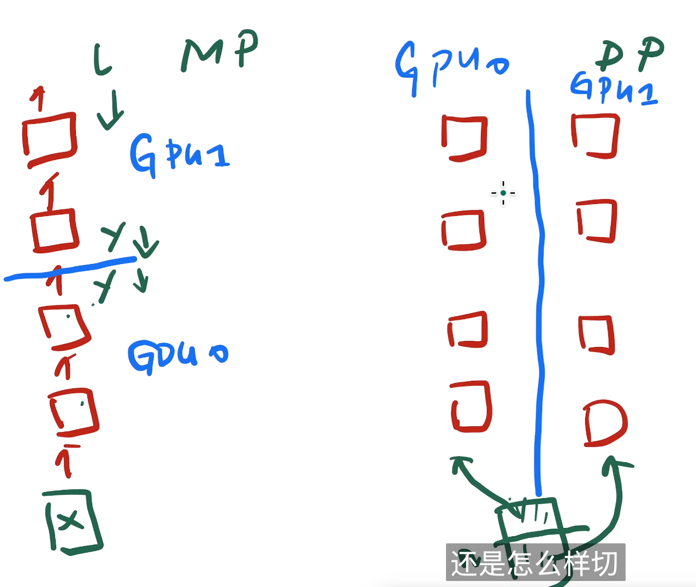
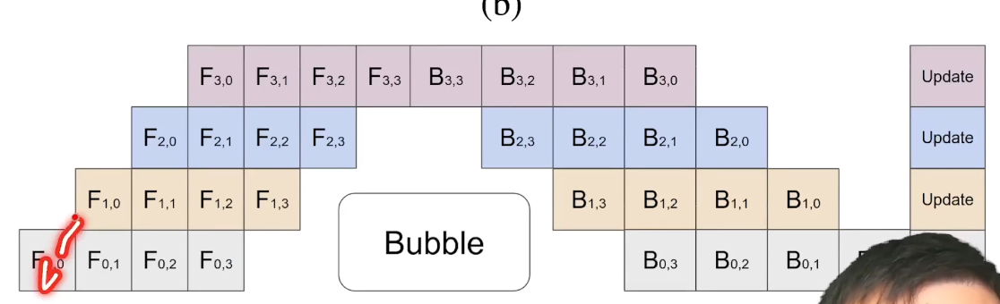

# Gpipe

Pipeline Parallelism，流水线并行。

发在了NeurIPS。

Model parallelism。把模型切成小块

对实际存在的任务做优化，而不是为了做一个更大的系统，去做优化。也就是说你在提出一个更好的系统，他能训练更多的模型之后，你需要证明你这个系统支持的模型是有意义的。

这是因为如果以后你换别的模型之后，你的优化可能就不好用了。

GPU的内存没怎么涨，是因为GPU计算的很快，为了让数据跟得上内存的带宽就得很快，就会很贵。

用了两个技术，Gpipe是在Lingvo上实现的。基于tensorflow的框架开发的，追求可重复性，把数据集，超参数都写在了里面。别人的代码可以直接复现。

把网络切成k块，然后就放到k个加速器上算。按层切。

大家还是prefer数据并行。

只是内存大了，但是速度每块。

做流水线并行，再把数据切一下。

 

中间结果最好不要丢，因为后面反传会用到，但是他很耗内存。

re- materialization

删掉一些中间变量去节约内存。

切的时候尽量每一块计算代价差不错

模型并行还可以竖着切

同期还有一篇PipeDream，也提出了流水线。

简单的反而讨论的更多，可能会有更多的讨论。

contribution：efficiency，flexibility and reliability。

reliability其实也是局限性，因为他只能支持穿起来的网络，当然就是所有穿起来的网络都能用。