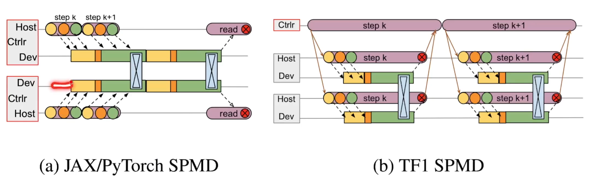
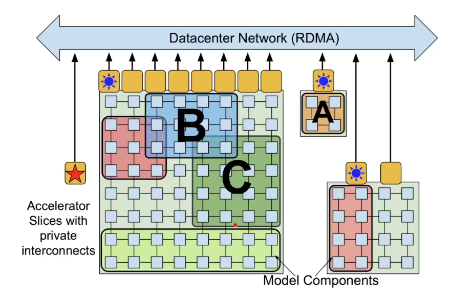
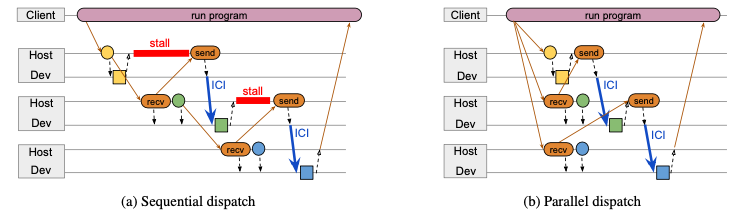

计算利用率很高

Jeff Dean：Tensorflow

Sanjay

一个blog Introduction to pathways

有点像MOE了不得不说

作者老多

分布式的机器学习

现在都是“single program multiple data”（SPMD），每台机器同样的代码，每个机器用自己的进程，中间交流一下。

数据并行，每台机器拿到自己的数据，基本上就是一个小批量，算好之后返还给一个中心节点，然后把这些结果全加起来就行。

现在模型太大了，卡不够大。

追求“multiple program multiple data”（MPMD），模型参数同时被多个任务使用。

PyTorch就是没有controller，每台机器执行自己的。TF有个controller，去给每个机器派任务。但是当后来，计算节点变多之后，每个计算节点计算量变少之后，计算速度的瓶颈卡在收发消息这里，也就是卡在通讯那里。

TensorFlow 高效性。构建一个计算图，编译。

TPU的设计

就一个pod有很多tpu核，这个tpu核之间带宽很高，但是如果想要用多pod就很难，pathways想解决的大概就是用多pod的这个问题

TPU单线程。可能会有死锁，可以多线程。要不就排序排好。

并行异步

这个很像那个MOE里面的Gate，就是那个client，也是其实已经之后后面的信息了，可以提前告诉。

GPU底层的drive已经做的挺好了，所以文章里的很多优化在GPU已经做掉了，所以可能不是很适合GPU

这篇文章没有解决太有意思的问题，但是future work可能很好。

只突破以前只能在一个tpu pod训练的限制，但是这个基本就是为Google内部服务的。跟他的JAX，xla设计很相关。