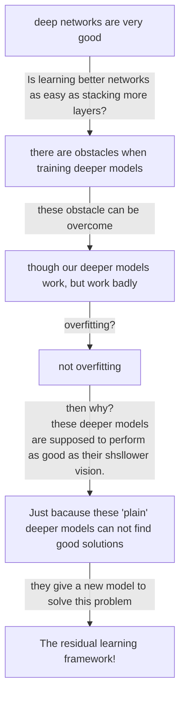

# Deep Residual Learning for Image Recognition

[TOC]

The core concept of this paper is the idea of using residual.

## Abstract

The first sentence presents the problem they researched, which is "difficult to train" very deep neural networks. The second sentence shows the result of their work: they got a framework that can ease the training. Then they show the methods they used. In the last, they said they have enough evidence to show their network is indeed excellent.

Besides, easing the training, their framework can also make more improvements than previous networks.

## **Introduction**

Figure 1 shows that we you use some "plain" network, the deeper network is actually not working, and this actually shows the phenomena about the problem they researched.

At the beginning of the first paragraph, the author presents that the deep CNN is very good. Then the author shows that the good performance of deep neural network are related to depth. This is all background and previous studies.

Then, in the second paragraph, the author presents a question: Is learning better networks as easy as stacking more layers? The following part introduces some obstacles we may face when our models are deeper. Though there are obstacles, we have some methods to overcome them. This is also about background and previous studies.

However, though we can let the deeper network work, it may work badly. As figure 1 shows above. Normally, we consider a deeper neural network to work badly because of overfitting. However, we find that it is not overfitting. 

The fourth paragraph said this situation should not happen because a deeper network can always have a solution as good as its shallower vision. So, the problem here is "our current solvers on hand are unable to find solutions that are comparably good or better than the constructed solution".

The third and fourth paragraph is mainly about the blank.

Then the fifth paragraph jumped into their work, which is a *deep residual learning* framework. Then in this paragraph, they introduced their framework mathematically.

The sixth paragraph said how they implement their framework in neural networks. Also, they emphasize that  their model do not add too much complexity to the original layer.

The last three paragraphs are about their results, which shows their model is very great.

## **Related Work**

### Residual Representations

This part in my view is most about why they think of residual. There are many previous studies had used methods whose core are take advantage of residual, so it would be naturally to think of applying some methods related to residual to DL area.

### Shortcut Connections

This part basically introduced shortcut connections, which were also not originally created by them. They reviewed the development of shortcut connections, and pointed out some differences between some recent works related to shortcut connections.

So you can see that even though your work is not original, you can still make some breakthroughs.

## **Deep Residual Learning**

### Residual Learning

This part shows why theoretically this model should work, and the inspiration.

### **Identity Mapping by Shortcuts**

detailed showing how they implement these, and some mathematical explanations

### Network Architectures

Because they do some comparison between plain network and their residual network, they talk about these structures of their trained models .

#### Plain Network

Structure of their plain network, like the kernel setting and so on. Some setting are meaningful, like they want complexity to be same.

#### **Residual Network**

Structure of their residual network. They just do some change in their plain network.

### **Implementation**

Detailed implementation, like tada pre-process, augmentation, normalization, and learning method they use and so on. 

## **Experiments**

###  **ImageNet Classification**

This part echoes to the last part, divided into two parts: plain network and residual network. 

We can see from Figure 4 that their framework lets deeper network work. It echoes to the figure 1.

#### Plain Networks

Comparing two different layer plain networks shows that the deeper one performed badly, and then analyzed this situation. However, they do not give a solid conclusion but a guess.

#### Residual Networks

Then they do the same experiment on ResNet. Through the comparison, then conclude that ResNet is performing well and converging faster.

#### Identity *vs*. Projection Shortcuts

Then they adjust the different methods to do the shortcuts. And they do some experience, analyzing the result getting some conclusion.

We can see that B and C kind of have the same performance, however, B is cheaper, so the author chose B in their later models.

#### Deeper Bottleneck Architectures

The ResNet now is like 50-layers, however, we know it can be deep like 1000, how did they do? This part is mainly about this thing. So, they use some new design which is called bottleneck. The core idea is mapping the big dimensional input(output from the last layer) to smaller dimensional data. 

##### 50-layer ResNet

They create a 50-layer network.

##### 101-layer and 152-layer ResNets

They also constructed 101 and 152-layer ResNets.

They find that the performance is better when the network is deeper.

#### Comparisons with State-of-the-art Methods

Through the comparison, we can see that their models are indeed performing very well.

### **CIFAR-10 and Analysis**

Besides ImageNet, they also apply their model to other datasets. This dataset is kind of small, and they do some small adjustments. How they do the experiment is similar to the experiment they have done above. Constructing two kinds of models(plain/ResNet), analyzing the results, and doing some comparisons.

#### Analysis of Layer Responses

Analyzing the response of each layer they find that their model's response is smaller when the depth increases, which supports their previous guess.

#### Exploring Over 1000 layers

Then they try 1000 layers, it is very shocking because it is too deep. However, their 1000-layer model still perform kind of good.

### **Object Detection on PASCAL and MS COCO**

They also do some other tasks using their model and their model performed very well.

# In the end

This paper involves too many results, which making they don't have enough space to write conclusion, from the writing perspective, it is kind of unnecessary, we would better make our structure standard.

This paper basically talk about using ResNet, we can build deeper neural network, however, there are only technical things and some experiences. They do not have some formal explanation(mathematical explanations). 

Later, most people not buy the explanation this paper presented. We believe that the reason why ResNet works well is because it keeps its gradient well, not because it can help the deeper layer close to identity functional layer.

Assuming that we have a function $g(x)$ and we add an layer to that we get $f(g(x))$.

Then, we have the gradient, so
$$
\frac{\partial f(g(x))}{\partial x} = \frac{f(g(x))}{\partial g(x)}\cdot \frac{\partial g(x)}{\partial x} \notag
$$
And if we have more layers, we have more products. It's a multiply-accumulated process. We also know the gradient in DL is very small, it's very close to 0, so when you multiply these values together, it will become smaller and smaller.

However, in Resnet, it's like
$$
\frac{\partial( f(g(x) ) +g(x))}{\partial x} = \frac{f(g(x))}{\partial g(x)}\cdot \frac{\partial g(x)}{\partial x} + \frac{\partial g(x)}{\partial x} \notag
$$
It's like a small value plus a bigger value, resulting in your gradient is still kind of big.

The reason why ResNet is better than plain models is that the plain model do not be completely trained, indeed the plain models converged, but convergence itself is meaningless, it's only mean we can't train this model better in some circumstance.

This can explain why ResNet trained fast but we can't use these to explain why ResNet has no significant overfitting without special regularization.  This is still a open question.

