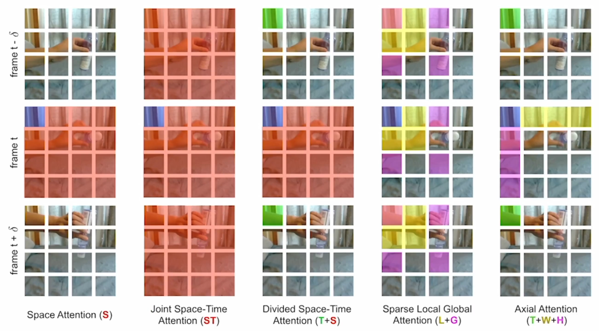

## 1. Hand- Crafted 到 CNN

### Deepvideo:

把图片处理转移到视频上，Single Frame就是个图片处理。Late Fusion，在网络输出做结合。Early Fusion在网络处理前做结合。Slow Fusion慢慢，一层层结合。 

但这些效果都很差，尤其是在做transfer的时候，所以还是尝试用图像处理方向的其他trick。

比如说Multiresolution CNN。依旧远远不如hand crafted.

## 2. Two-Stream

加optical stream

try early fusion

try deep network

+LSTM，two- stream抽特征，LSTM整合时序信息

加长视频

## 3. 3D CNN

双流太慢了，想直接从视频里学

### TSN

Temporal Segment Networks

提供了很多好用的tricks。

理解长视频。

感觉就是大段视频分成小段视频。

想法简单，但是十分有效。

tricks：

cross modality pre-training：拿RGB的模型当光流模型的初始化，大概意思就是可以拿别的地方的模型来用

Regularization：partial BN。

Data Augmentation：强制在边角裁剪；scale-jittering，换长宽高。

### C3D

用了更大的数据集和更深的网络。

3D版本的VGG。

主要用它抽取特征

效果不是SOTA，但是提供了接口，所以其他的研究者可以用。

### I3D

效果很好，奠定3D网络的地位。

Inflation，需要一个好的初始化。

### R（2+1）D

偏测试的论文，空间上的2D和时间上的1D，效果不错

2，3D混合效果不错。

主要贡献是消融实验。

### SlowFast

一边慢一边快，慢的抽帧抽的少，用大网络，快的抽帧抽的多，用小网络。

## 4. Video Transformer

### Non-Local

用self- attention。

non- local算子模块。其实就是self- attention的思想。

### TimesFormer 

做各种实验

用中间的

想法很简单，效果很好，cost很低，可以做稍微长一点的视频（1 min）。

## Summary

 

